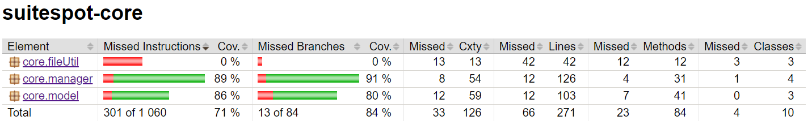
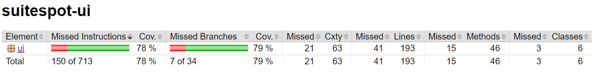
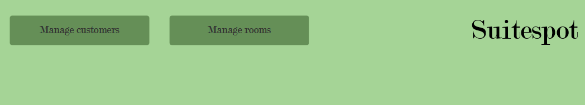

# Release 2


## Table of contents
- [Release 2](#release-2)
  - [Table of contents](#table-of-contents)
  - [Introduction](#introduction)
    - [FileTypeEnum](#filetypeenum)
    - [JsonFile](#jsonfile)
  - [Customer-interface](#customer-interface)
    - [Customer](#customer)
    - [CustomerManager](#customermanager)
  - [Room](#room)
    - [Room Type](#room-type)
    - [Room](#room-1)
  - [Testing](#testing)
  - [Functionality (so far)](#functionality-so-far)
  - [Checkstyle warnings](#checkstyle-warnings)

## Introduction
In our first release ( _Release 1_ ) we have created the Java-files in headers _"Introduction"_ and _"Customer-Interface"_. For the following release ( _Release 2_ ), we have implemented Java-files under _"Room"_. In _"Test"_ and _"Functionality"_, we have implemented files accordingly to the appropriate release.   

### FileTypeEnum
You can find `FileTypeEnum` in the _core/fileUtil_-folder: this is were we handle our file-management.

Enumerations in general defines a set of named constants. In our case, `FileTypeEnum` uses the constants "CUSTOMER", "BOOKING" and "ROOM". This is helpful when we create the booking- and room-classes.

### JsonFile
The `JsonFile` can also be found in the _core/fileUtil_-folder.

The purpose of the file is to create an instance with the class you want to save, and the name of the file you want to save to. The JsonFile:
- appends to file
- writes to file
- reads to file


## Customer-interface

### Customer 
In the folder _model_, you can find the `Customer`-file. 

The `Customer`-file is a data-object, for keeping track of one customer. There are different validation-methods, using regex.

### CustomerManager
`CustomerManager` is located in the _manager_-folder.

In `CustomerManager`, the customer-ID is created, and it consists of logic for saving, creating, editing and deleting customers. The java-file is exposed to the core-folder.

## Room
### Room Type
In the folder _model_, you'll find the `RoomType`-file. 

The `RoomType`-file is a data-object. When creating a room type-object, you create an id for saving, creating, editing and deleting room types. 


### Room
`Room` is located in the folder _model_ as well. 

The `Room`-file is also a data-object. The same principles is used as above, where you can create an id for further use. 


## Testing
In release 1, we tested some of the different validation-methods in the `Customer`-file. We are only testing the core-functionality, where the test coverage of `Customer` is at 80%. 

For the second release, we tested room core logic for the `Room`, `RoomType` -files and their managers. We also extended the customer testing to include `CustomerManager` which is covered at 91%. In addition, we complimented with UI tests for both the customer UI and the room UI, where the test coverage is at 79%.


The fileUtil package is not tested since this is based on an exernal system, the file system. The test package has a mock implementation that uses memory in order to test the classes that depends on fileUtil. 


 


For full report see [jacoco](../../suitespot/core/target/site/jacoco/index.html) after running: 
```
mvn verify
```

## Functionality (so far)
As of now, `Suitespot` lets you open the main page from the layout-user-interface. From here, you can press either _"Manage customer"_ or _"Manage rooms"_.

 

When you click on _"Manage customers"_, you get to create, edit and delete customers, from the customer-user-interface. If you wish to return to main page, you can click on that spesific button.


Furthermore, you can click on _"Manage rooms"_ from the main page. This will allow you to create, edit and delete a room type with your given name and price, from the room-user-interface. When you have created a room type, you can also create, edit and delete a spesific room in the given type. You can also change the room type to another already created room type.

 


## Checkstyle warnings
We still have quite a few checkstyle warnings, but they are mostly regarding javadoc. We have added javadoc on most public facing methods in core, but the methods we didn't add javadoc on are mostly self explanatory (getters, setters, etc). Both methods with and without javadoc are well named. There are other warnings on checkstyle too, but we didn't manage to figure out how to link checkstyle to the config file, so we can't change the preferences, since it's mostly about us having another coding style. 


