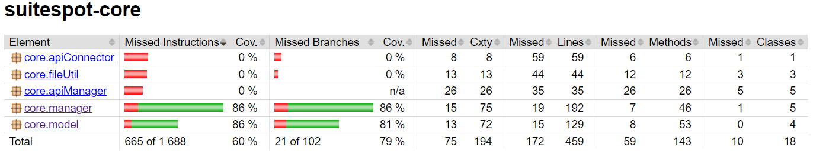
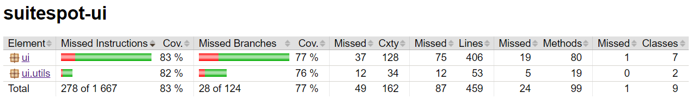
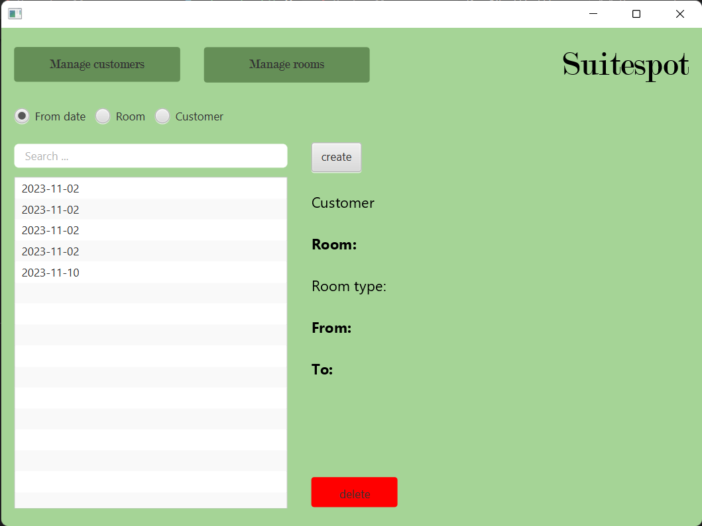
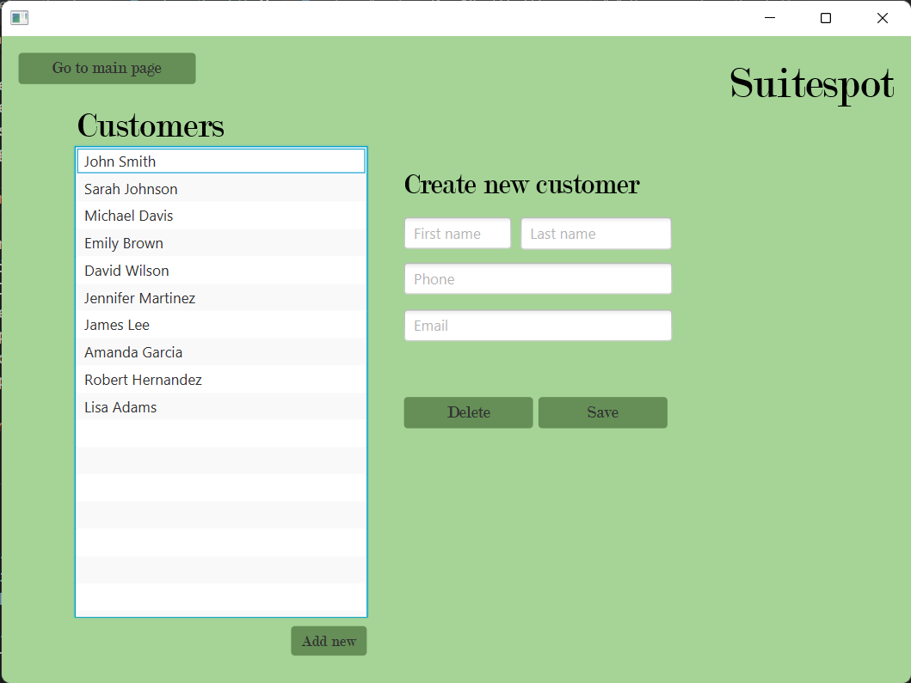
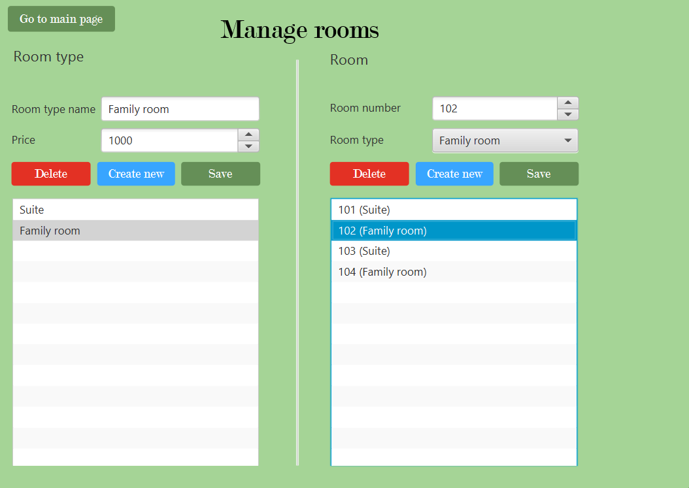

# Release 3


## Table of contents
- [Table of contents](#table-of-contents)
- [Introduction](#introduction)
  - [FileTypeEnum](#filetypeenum)
  - [JsonFile](#jsonfile)
- [Customer](#customer)
  - [Customer](#customer)
  - [CustomerManager](#customermanager)
- [Room Type and Room](#room-type-and-room)
  - [RoomType](#roomtype)
  - [RoomTypeManager](#roomtypemanager)
  - [Room](#room)
  - [RoomManager](#roommanager)
- [Booking](#booking)
- [Testing](#testing)
- [REST-API](#rest-api)
- [JPackage and J-Link](#jpackage-and-j-link)
- [Functionality](#functionality)
- [Checkstyle warnings and spotbugs](#checkstyle-warnings-and-spotbugs)

## Introduction
In our initial release, denoted as _"Release 1_", we crafted Java files within the categories of "Introduction" and "Customer." Moving on to _"Release 2"_, we extended our implementation to include Java files related to "Room." In the latest release, _"Release 3,"_ we finalized the remaining files, culminating in a fully functional booking application. The newly integrated files for booking functionality are located under the "Booking" section. Additionally, in the sections labeled "Test" and "Functionality," we implemented files in alignment with the respective release updates.

In the more recent releases, we have corrected some of the initially written code and implemented new functions in a previous release. Therefore, we've chosen to include and supplement the documentation from earlier releases within this document.

### FileTypeEnum
You can locate `FileTypeEnum` within the _core/fileUtil_-folder, which is where we manage our file operations.

Enumerations in general defines a set of named constants. In our case, `FileTypeEnum` uses the constants "CUSTOMER", "BOOKING" and "ROOM". This proves advantageous, particularly when crafting the booking and room classes.

### JsonFile
The `JsonFile` can also be found in the _core/fileUtil_-folder.

The purpose of the file is to create an instance with the class you want to save, and the name of the file you want to save to. The JsonFile includes functonality such as:
- append to file
- write to file
- read to file


## Customer 

### Customer 
In the _model_ folder, you will discover the `Customer` file, which serves as a data object for managing individual customers. This file includes various validation methods utilizing regular expressions.

### CustomerManager
In the _manager_ folder, `CustomerManager` is located. Here is the customer-ID generated, and consists of logic for creating, editing, saving and deleting customers. 

## Room Type and Room 
### RoomType
In the folder _model_, you'll find the `RoomType`-file, which is also a data-object. Sorting the rooms into different room types makes it easier for the manager to find the correct price and size based on the customers' preferences. 

### RoomTypeManager
In the `RoomTypeManager`-file, you generate the room type-ID for creating, editing, saving and deleting room types. Additionally, you can verify the availability of a room type to prevent duplicates.

### Room
`Room` is also situated in the _model_ folder, serving as a data object to manage individual rooms. Each room is assigned an unique ID, along with a room number and a specific room type. A room is reserved for a booking, ensuring a one-to-one correspondence between bookings and rooms.

### RoomManager
In the _manager_ folder, you'll locate `RoomManager` where you can generate a room  ID, as well as create, edit, save and delete rooms. Moreover, it provides the functionality to check the availability of a room.

## Booking

### Booking
Finally, the `Booking` file is situated in the model folder. It serves as a data object, capturing information related to bookings. When initiating a booking, you begin by selecting the desired dates, choosing an available room type and room, and then specifying the customer's name.

### BookingManager
In the _manager_ folder, you'll find the `BookingManager` file, where you can generate an ID for creating, editing, saving, and deleting bookings.

## Testing
In the first release, testing was minimal due to the limited amount of code logic. However, we focused on testing essential core functionalities. Specifically, we conducted tests on various validation methods within the `Customer` file, resulting in a test coverage of 80%.

In the second release, we delved into testing the core logic of rooms, including the `Room` and `RoomType` files along with their respective managers. In addition, we expanded customer testing to incorporate the `CustomerManager`, achieving an test coverage of 91%. Furthermore, we complemented these efforts with UI tests for both `CustomerController` and `RoomController`, resulting in a test coverage of 79%.

In the latest and third release, the architecture has become more comprehensive, necessitating additional tests. Consequently, we have executed tests for the remaining files in both core and UI. Tests have been made for  _model_-files in core, namely `Customer` and `Booking`, resulting in a cumulative test coverage of 86%. Additionally, for _manager_-files such as `RoomManager`, `RoomTypeManager`, and `BookingManager`, the test coverage is also 86%.

Regarding UI tests, we have implemented tests for the remaining controllers `CreateBookingController` and  `AppController`, achieving an overall test coverage of 83%.

The fileUtil package remains untested as it relies on an external system, namely the file system. To address this, the test package incorporates a mock implementation that utilizes memory to test classes dependent on fileUtil.

Contrastingly, UI-utils have undergone testing, achieving a test coverage of 82%.


 


For full report see [jacoco](../../suitespot/core/target/site/jacoco/index.html) after running: 
```
mvn verify
```

## JPackage and J-Link
To create the final executable for the project, we utilized J-Link and JPackage. For instructions on building this application, refer to the [root readme](/gr2305/readme.md).

## REST-API
This release includes the addition of a REST-API. The app has a new implementation of each manager, that connects to the API with a generic class, `ApiClient`. The REST-API exposes the API of our existing controllers as HTTP endpoints. The documentation for these endpoints lies [here](/gr2305/docs/restapi.md).


## Functionality
`Suitespot` enables you to access the main page through the layout-user interface. Once there, you have the option to navigate to either _"Manage Customer"_ or _"Manage Rooms"_. Additionally, we have implemented a feature that provides an overview of booked dates. These dates are linked to a room, room type, and a customer, and the details are displayed upon clicking the booking. The list of bookings allows you to sort them based on your preference using radio buttons. To locate a specific booking, you can scroll through the list or use the search bar above. Furthermore, you have the ability to delete a selected booking by marking it and pressing the delete button. 

 

When you click on _"Manage customers"_, you get to create, edit and delete customers, from the customer-user-interface. If you wish to return to main page, you can click on that spesific button.



Furthermore, by selecting _"Manage rooms"_ from the main page, you gain access to features that enable you to create, edit, and delete room types, specifying names and prices through the room-user interface. After establishing a room type, you can proceed to create, edit, or delete specific rooms within that category. Additionally, the system allows you to switch a room's type to another pre-existing room type.

 


## Checkstyle warnings and spotbugs
Although we have zero checkstyle violations, we still encounter several checkstyle warnings and the majority concerns javadoc. We've included javadoc for most public-facing methods in  _core_, except for those that are self-explanatory, such as getters and setters. Both documented and undocumented methods are aptly named. 

There are additional warnings in checkstyle, regarding lexicographical order. We've struggled to connect checkstyle to the config file and we're unable to modify our preferences in coding styles. Therefore, most warnings are due to our personal prefrences in coding style. 

On a positive note, our spotbugs analysis has zero errors, reflecting a more extensive and thorough testing process. As a result, we've prioritized our focus on spotbugs testing.


