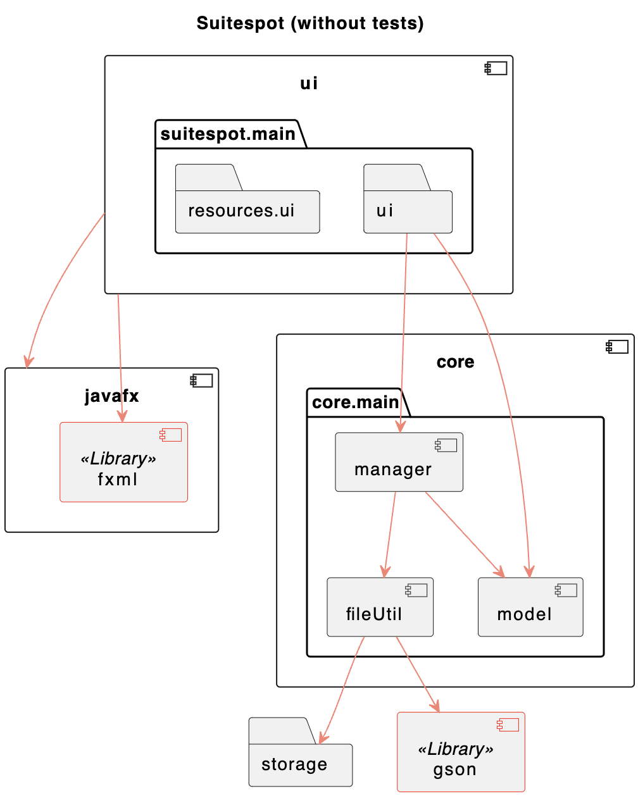

# Group gr2305 repository - IT1901 fall 2023
> benjakil, eliashet, sbnorton, katrimik 

## Eclipse che
[open master in Eclipse Che](https://che.stud.ntnu.no/#https://gitlab.stud.idi.ntnu.no/it1901/groups-2023/gr2305/gr2305?new)

[open dev in Eclipse Che](https://che.stud.ntnu.no/#https://gitlab.stud.idi.ntnu.no/it1901/groups-2023/gr2305/gr2305/-/tree/dev?new)

### What the app does
See [suitespot/app-description](./suitespot/app-description.md)

### Cloning the project
```bash
git clone https://gitlab.stud.idi.ntnu.no/it1901/groups-2023/gr2305/gr2305.git
``` 

### Branches

```bash
# the newest approved version will be located in dev branch: 
git pull 
git checkout dev

# Latest release wil be located in master:
git pull 
git checkout master

# for other branches use:
git checkout <BranchName> # to view branch

git ls-remote # to list branches

```

## Local versions
This can be tedious if you don't have the right environment, but should be straight forward if you're on windows with maven and java installed.Any subversion of 17 should work fine. 

> Recommended versions:    
java: `17.0.5`    
maven: `3.9.4`

## Where to find code
- The entire code project is located in the folder:
    - `suitespot`.
- This folder contains two modules:
    - `suitespot/core` (business logic)
    - `suitespot/ui` (ui logic)

## Run locally
Commands to prepare the project might vary based on the packages installed and other local factors. Here's a good starting point.
```bash
 # commands to install the system. Might need different ones depending on your local setup. run these in the suitespot folder, the core folder and the ui folder separatly. Build core before ui since ui depends on core. 
 mvn clean package
 mvn clean install # see remark 1
 mvn clean install -D maven.test.skip # might not be necessary
 mvn compile
 

 # to run app
 cd suitespot/ui # from root of repo
 mvn javafx:run  # run app
 mvn test        # run tests

 # to run jacoco tests
 mvn verify      
```

**remark 1**    
If the app is running, the command will fail. Close all instances of the app. Make sure to not only close the processes in the terminal, since the app will still run. The app might run with an old version of the core module if this step fails. 

# Package diagram
Package diagram showing the modules and folders in our project; created with PlantUML. 


Click here to read about our [workflow](./docs/release2/workflow.md).