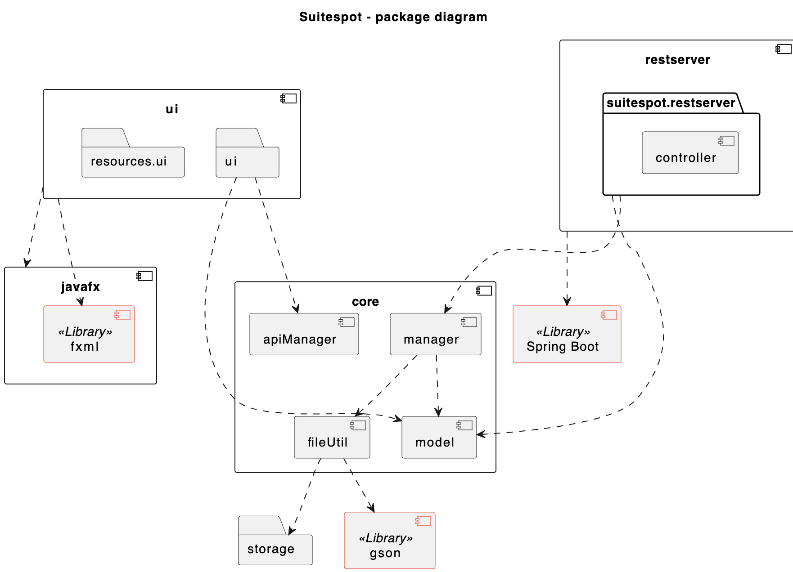
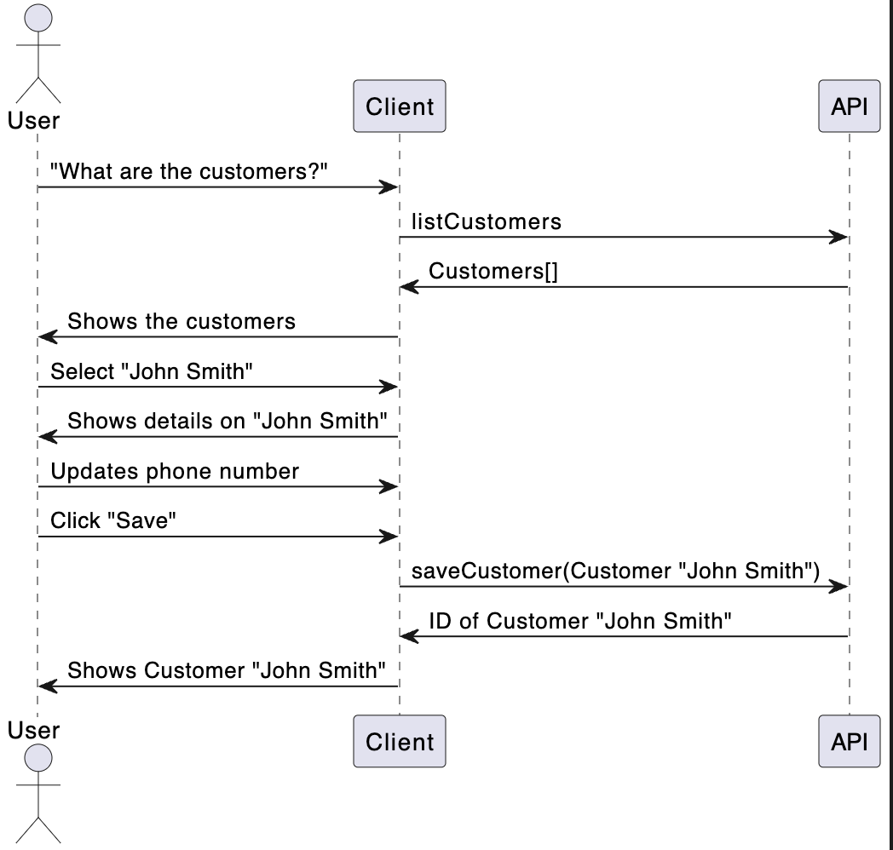
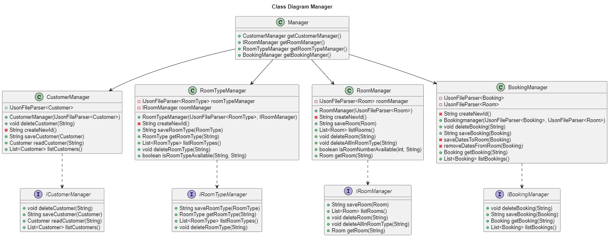
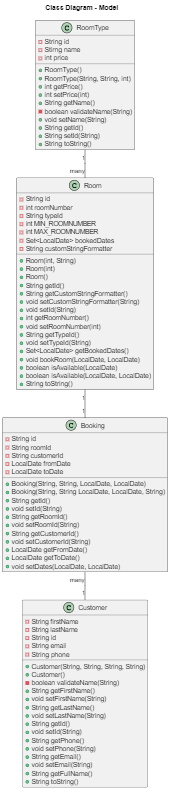

# Group gr2305 repository - IT1901 fall 2023
> benjakil, eliashet, sbnorton, katrimik

## Table of contents
- [Links](#links)
- [Cloning the project](#cloning-the-project)
- [Local versions](#local-versions)
- [Run locally](#run-locally)
- [Run server locally](#run-server-locally)
- [Build project](#build-project)
- [Where to find code](#where-to-find-code)
- [Diagrams](#diagrams)
    - [Package diagram](#package-diagram)
    - [Sequence diagram](#sequence-diagram)
    - [Class diagrams](#class-diagram)

## Links
### Eclipse che
- [Open master in Eclipse Che](https://che.stud.ntnu.no/#https://gitlab.stud.idi.ntnu.no/it1901/groups-2023/gr2305/gr2305?new)
- [Open dev in Eclipse Che](https://che.stud.ntnu.no/#https://gitlab.stud.idi.ntnu.no/it1901/groups-2023/gr2305/gr2305/-/tree/dev?new)

### Docs
- Click here to read about our [workflow](./docs/release2/workflow.md).
- Click here to read all [docs](./docs/).
- Click here to read API [docs](./docs/restapi.md).
- [Release 1](./docs/release1/release1.md)
- [Release 2](./docs/release2/release2.md)
- [Release 3](./docs/release3/release3.md)

### App description
- See [suitespot/app-description](./suitespot/app-description.md)

## Cloning the project
```bash
git clone https://gitlab.stud.idi.ntnu.no/it1901/groups-2023/gr2305/gr2305.git
``` 

### Branches

```bash
# the newest approved version will be located in dev branch: 
git pull 
git checkout dev

# Latest release wil be located in master:
git pull 
git checkout master

# for other branches use:
git checkout <BranchName> # to view branch

git ls-remote # to list branches

```

## Local versions
This can be tedious if you don't have the right environment, but should be straight forward if you're on windows with maven and java installed. Any subversion of 17 should work fine. 

> Recommended versions:    
java: `17.0.5`    
maven: `3.9.4`


## Run locally
Commands to prepare the project might vary based on the packages installed and other local factors. Here's a good starting point.
```bash
 # commands to install the system. Might need different ones depending on your local setup. run these in the suitespot folder, the core folder and the ui folder separatly. Build core before ui since ui depends on core. 
 mvn clean install # see Remark 1

 # The server needs to run for the app to work, see Run server locally section

 # to run app
 cd suitespot/ui # from root of repo
 mvn javafx:run  # run app
 mvn test        # run tests

 # to run jacoco tests
 cd suitespot
 mvn verify      
```

**Remark 1**    
If the app is running, the command will fail. Close all instances of the app. Make sure to not only close the processes in the terminal, since the app will still run. The app might run with an old version of the core module if this step fails.

## Run server locally
```bash
# change directory to suitespot/restserver
cd suitespot/restserver

# start spring-boot server with maven
mvn spring-boot:run

# the server vil now start up and expose the endpoints to localhost:8080/
```

- Click here to read API [documentation](./docs/restapi.md).


## Build project
```bash
# Make sure everything is compiled
cd suitespot
mvn clean install
cd ui

# Builds the project into an executable for your respectable platform (.exe on windows)
# This depends on wix which depends on .net 3.5
# Download .NET from: https://www.microsoft.com/en-us/download/details.aspx?id=21
# Download WIX from: https://github.com/wixtoolset/wix3/releases/tag/wix3112rtm
mvn clean compile javafx:jlink jpackage:jpackage
# The finished executable is under /suitespot/ui/target/dist/...
```


## Where to find code
- The entire code project is located in the folder:
    - [`suitespot`](./suitespot/)
- This folder contains three modules:
    - [`suitespot/core`](./suitespot/core/src/main/java/core/) (business logic)
    - [`suitespot/ui`](./suitespot/ui/src/main/java/ui/) (UI logic)
    - [`suitespot/restserver`](./suitespot/restserver/src/main/java/suitespot/) (REST-API)

### Code location diagram
```
suitespot/
├─ core/
│  ├─ src/
│  │  ├─ main/
│  │  │  ├─ java/
│  │  │  │  ├─ core/
│  │  │  │  │  ├─ fileUtil/
│  │  │  │  │  │  ├─ Files for handling storage
│  │  │  │  │  ├─ manager/
│  │  │  │  │  │  ├─ Managers (crud operations on models)
│  │  │  │  │  ├─ apiManager/
│  │  │  │  │  │  ├─ Managers (that connect to the API, implement same interfaces as normal managers)
│  │  │  │  │  ├─ model/
│  │  │  │  │  │  ├─ Data models (classes that contain data and validation)
│  │  ├─ test/
│  │  │  ├─ java/
│  │  │  │  ├─ core/
│  │  │  │  │  ├─ tests for core
├─ restserver/
│  ├─ src/
│  │  ├─ main/
│  │  │  ├─ java/
│  │  │  │  ├─ suitespot/
│  │  │  │  |  ├─ restserver/
│  │  │  │  |  |  ├─ API server and endpoints
│  │  ├─ test/
│  │  │  ├─ java/
│  │  │  │  ├─ suitespot/
│  │  │  │  |  ├─ restserver/
│  │  │  │  |  |  ├─ API endpoint tests
├─ ui/
│  ├─ src/
│  │  ├─ main/
│  │  │  ├─ java/
│  │  │  │  ├─ ui/
│  │  │  │  │  ├─ Controllers and layout managers
|  |  ├─ test/
│  │  │  ├─ java/
│  │  │  │  ├─ ui/
|  |  |  |  |  ├─ UI tests
├─ storage/
│  ├─ Json files that stores data
```
 

## Diagrams
### Package diagram
Updated package diagram for release 3, showing the modules and folders in our project; created with PlantUML. 

*Image of PUML package diagram. See code [here](./docs/release3/r3-package-diagram.puml)*.


### Sequence diagram
Sequence diagram created for [US-2](/userstories.md). Created with PlantUML.

*Image of sequence diagram. See code [here](./docs/release3/r3-sequence-diagram.puml)*.

### Class diagram
Class diagram for the most crucial functionality. Created with PlantUML.
Here is the class diagram showing the manager functionality.

*Image of class diagram. See code [here.](./docs/release3/r3-class-diagram-manager.puml)*

In addition, here is the class diagram showing the model functionality. 



*Image of class diagram. See code [here.](./docs/release3/r3-class-diagram-model.puml)*