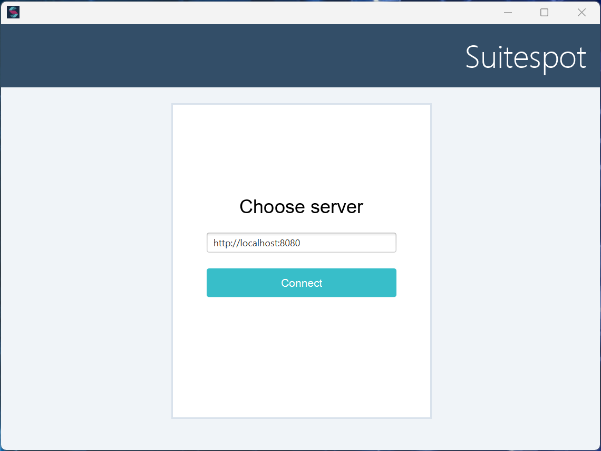
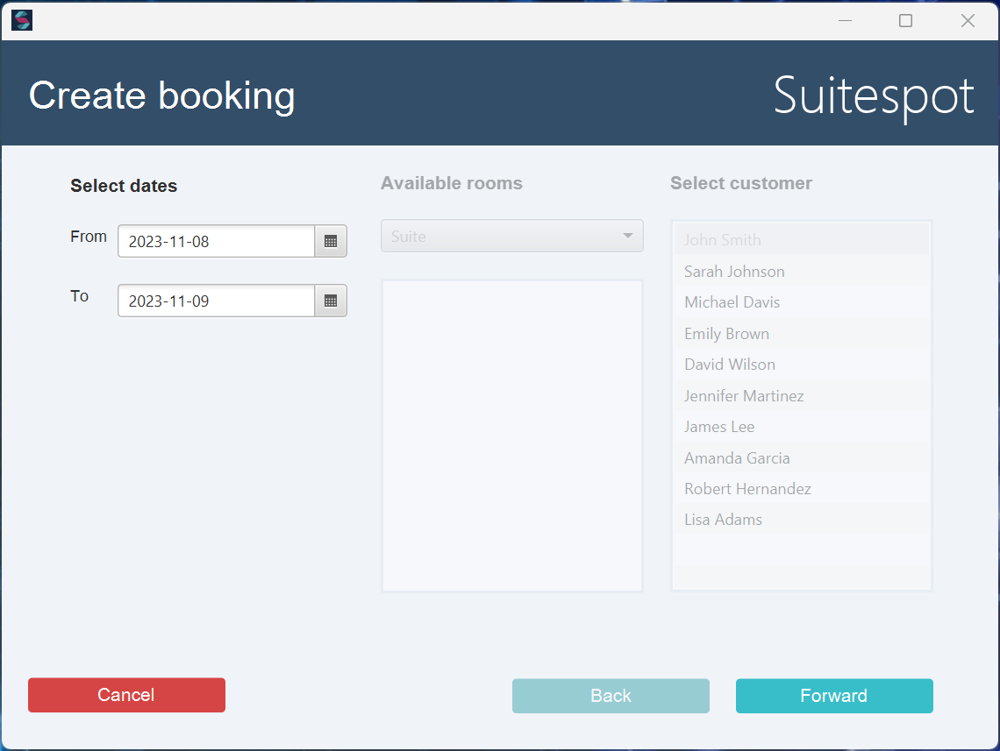
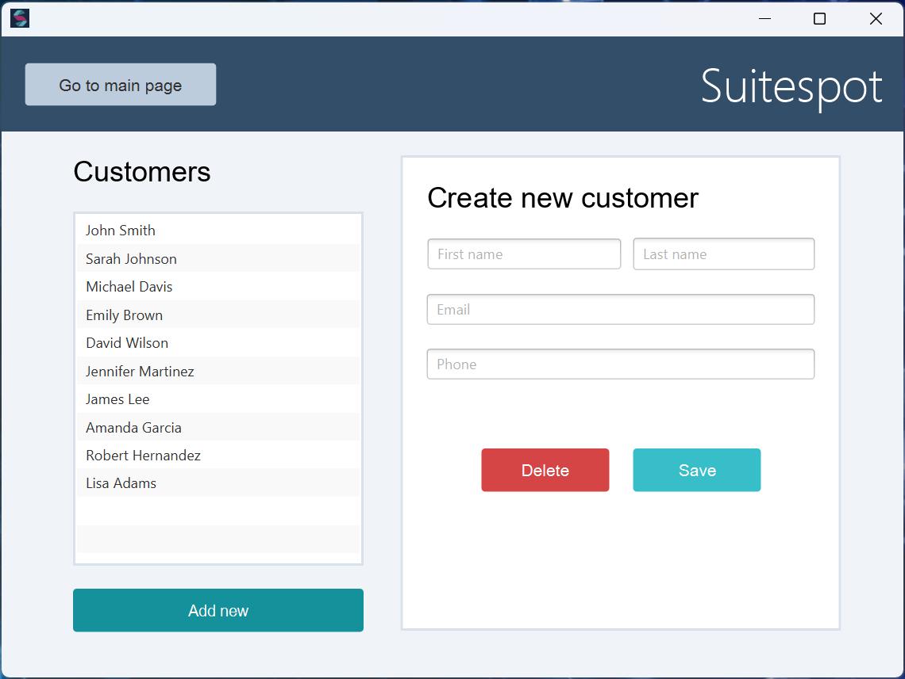
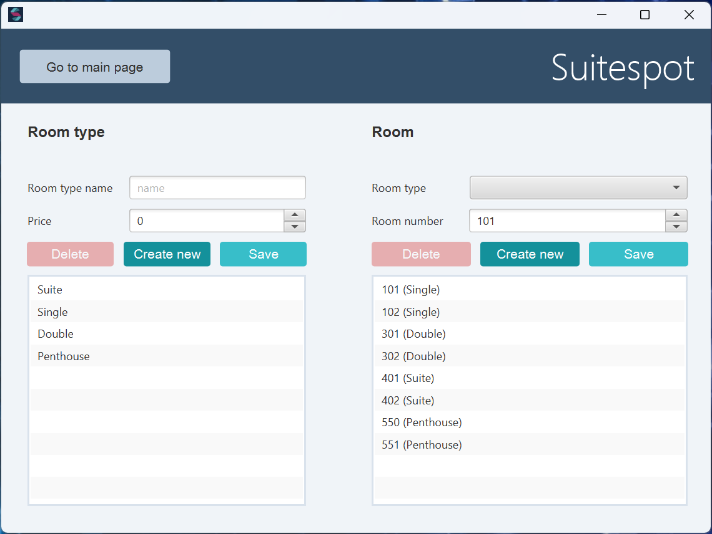

# App description
TLDR; Hotel booking desktop applicaiton

### App brief description
This application functions as a hotel booking system, commonly referred to as a Property Management System (PMS). Using this app, you have the ability to establish various room types and their corresponding rooms. It enables the creation, editing, and deletion of customer profiles, as well as the generation of bookings. Each booking is associated with a specific customer and is linked to a particular room during a specified time period.

## Views
There are 5 views/windows in this application. The reason we call it views is because it lives in a single windows window, a so called SPA (single page application). The views are the following:

- **Connect Server View**: Connect to the correct server ip
- **Main View**: Manage bookings and menus to navigate to other views.
- **Create Booking View**: Create a booking by selecting from and to date, room and customer. Only available rooms in the time period selected will show up.
- **Customer View**: View and manage customers.
- **Manage Room View**: Manage room-types and rooms.

## Images

### Connect Server View

### Main View

### Create Booking View

### Customer View

### Manage Room View
