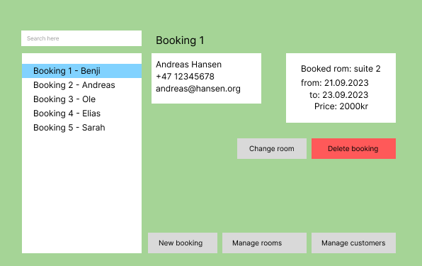
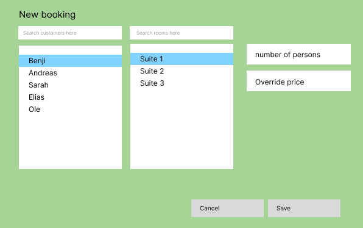
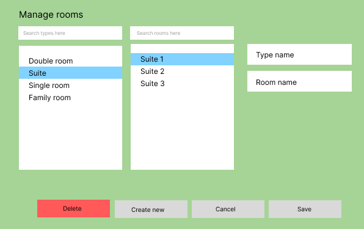

# App description

### Goal
This is the beginning of a PMS (property management system). The goal is to create an app to keep track of bookings, available rooms and customers. 

### Current iteration
Right now the application supports customers and rooms. You can create, read, update and delete customers, roomtypes and rooms.

### Current UI (release 1)

### User stories
- A new customer walks into the reception of the hotel and wants a hotel booking. The receptionist saves the customer in the system.

- The customer provided the wrong email, and realizes when the receptionist already saved the details in the system. The receptionist selects the customer, changes the details and saves.

- The hotel built a new floor. The manager are now able to create new rooms with a certain type.

### Future UI mockups
> The future UI mockups are subject to change, but illustrate what the application is supposted to do. 

